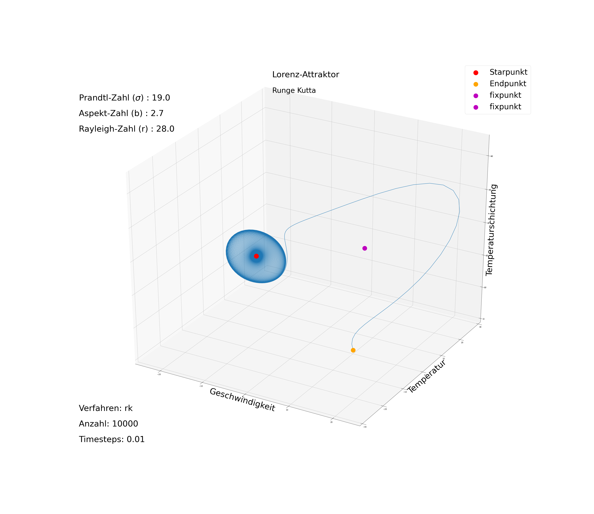
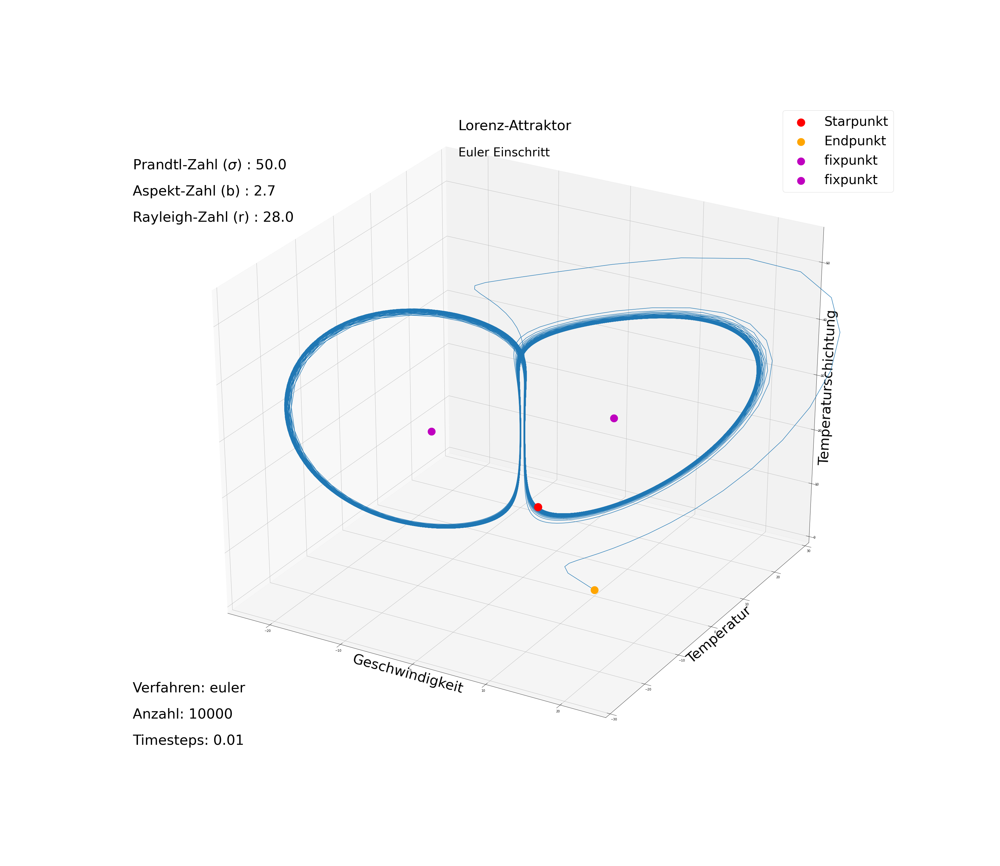

# Lorenz

## Compile

```bash
gcc -o lorenz lorenz.c
```

## Lorenz attractor 


$$\phi_X^{n+1} = \phi_X^n + \Delta t~(-\sigma X~+~\sigma Y)$$

$$\phi_Y^{n+1} = \phi_Y^n + \Delta t~(-XZ~+~rZ~-~Y)$$

$$\phi_Z^{n+1} = \phi_Z^n + \Delta t~(XY~-~bZ)$$

$$\frac{d\vec{x}}{dt}=f_D(\vec{x}) ~ + ~ f_K(\vec{x})$$


### Example






## henon map

$$x_{n+1} = y_n +1 - a x^2_n$$

$$y_{n+1} \,=\, \beta x_n$$

$\alpha$=1.4

$\beta$=0.3

### fix points

$$X=1-\alpha X^2 + bX$$


## Rössler-Attraktor


$$\dot{x} \,=\, -y \,-\, z$$

$$\dot{y} \,=\, x \,+\, \alpha y$$

$$\dot{z} \,=\, \beta \,+\, z(x\,-\,c)$$


$\alpha$=$\beta$=0.2
c=5.7
